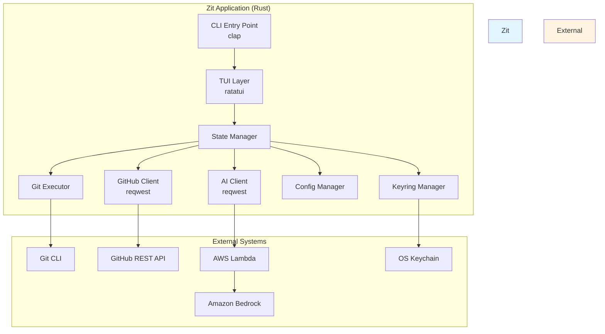

# Design Document: Zit

## Overview

Zit is a terminal-based Git assistant built on three core principles: **safety by default**, **teach while doing**, and **zero context switching**. The system acts as a safety and learning layer on top of Git, never reimplementing Git internals but instead orchestrating the native Git CLI through a keyboard-driven TUI with optional AI guidance.

### Architecture Philosophy

**Thin Orchestration Layer**: Zit is fundamentally a Git CLI orchestrator. All Git operations execute through shell commands, ensuring 100% compatibility with Git's behavior and eliminating the risk of divergence from Git semantics.

**Stateless Design**: The TUI maintains no persistent state about the repository. Every view refresh queries Git directly, ensuring the displayed state always reflects reality. This eliminates state synchronization bugs at the cost of slightly higher Git command frequency.

**AI as Optional Enhancement**: The AI mentor is a guidance layer, not a dependency. All core functionality works without AI. When AI is unavailable, the system degrades gracefully to static help text and command explanations.

**Keyboard-First Interaction**: Every operation is accessible via keyboard. The TUI uses vim-style navigation (hjkl) alongside arrow keys, with single-key shortcuts for common operations.

### Technology Stack Rationale

**Rust**: Memory safety, zero-cost abstractions, excellent error handling, and strong ecosystem for CLI tools. Cross-platform compilation to single binaries simplifies distribution.

**ratatui + crossterm**: Industry-standard TUI framework with active maintenance, comprehensive widget library, and excellent terminal compatibility. crossterm provides cross-platform terminal manipulation.

**clap**: Declarative CLI argument parsing with automatic help generation and shell completion support.

**reqwest**: Async HTTP client with TLS support for GitHub API and Lambda backend communication.

**tokio**: Async runtime for concurrent Git command execution and non-blocking HTTP requests.

**serde + serde_json**: Serialization for GitHub API payloads and configuration files.

**keyring**: Cross-platform secure credential storage using OS-native keychains.

## High-Level Architecture



### Data Flow

**User Interaction Flow**:
1. User presses key → crossterm captures input
2. TUI routes input to active view handler
3. View handler updates local UI state or triggers Git operation
4. Git operation executes via Git Executor
5. Git Executor returns result (success/failure + output)
6. State Manager updates affected state
7. TUI re-renders affected components

**Git Command Flow**:
1. State Manager requests operation (e.g., "stage file X")
2. Git Executor constructs Git command
3. Git Executor spawns shell process with command
4. Git Executor captures stdout, stderr, exit code
5. Git Executor parses output or returns error
6. Result propagates back to State Manager
7. State Manager triggers TUI refresh

**AI Guidance Flow**:
1. User requests explanation or encounters error
2. AI Client constructs request payload (metadata only)
3. AI Client sends HTTPS request to Lambda
4. Lambda invokes Bedrock with prompt
5. Bedrock returns response
6. Lambda validates and returns to AI Client
7. AI Client displays response in TUI modal
8. If Lambda unavailable, display fallback message


## Components and Interfaces

### 1. CLI Entry Point

**Responsibility**: Parse command-line arguments, initialize application, handle global flags.

**Interface**:
```rust
pub struct Cli {
    /// Path to repository (defaults to current directory)
    #[arg(short, long)]
    pub path: Option<PathBuf>,
    
    /// Enable debug logging
    #[arg(short, long)]
    pub debug: bool,
    
    /// Disable AI features
    #[arg(long)]
    pub no_ai: bool,
}

pub fn main() -> Result<()> {
    let cli = Cli::parse();
    let app = App::new(cli)?;
    app.run()
}
```

**Key Decisions**:
- Single binary with no subcommands (launches directly into TUI)
- Repository path defaults to current directory
- Debug flag enables verbose logging to file
- `--no-ai` flag disables AI features for offline use


### 2. TUI Layer

**Responsibility**: Render interface, handle keyboard input, manage view state, coordinate component updates.

**Architecture**:
```rust
pub struct Tui {
    terminal: Terminal<CrosstermBackend<Stdout>>,
    current_view: View,
    state: Arc<Mutex<AppState>>,
}

pub enum View {
    Dashboard,
    Staging,
    CommitEditor,
    Timeline,
    Reflog,
    BranchManager,
    Help,
}

impl Tui {
    pub fn render(&mut self) -> Result<()>;
    pub fn handle_input(&mut self, event: Event) -> Result<Action>;
    pub fn switch_view(&mut self, view: View);
}
```

**View Components**:

**Dashboard View**:
- Top panel: Branch name, ahead/behind count
- Left panel: Staged files list
- Right panel: Unstaged files list
- Bottom panel: Recent commits (5 most recent)
- Status bar: Stash count, conflict indicator

**Staging View**:
- Left panel: File list with status icons
- Right panel: Diff preview with syntax highlighting
- Bottom bar: Keyboard shortcuts (s=stage, u=unstage, h=stage hunk)

**Commit Editor View**:
- Top panel: Subject line input (50 char limit indicator)
- Middle panel: Body input (72 char line limit indicator)
- Bottom panel: Staged files summary
- Side panel: AI suggestions (if available)


**Timeline View**:
- Main panel: Commit graph with ASCII art branches
- Detail panel: Selected commit details and diff
- Filter bar: Search input for message filtering
- Pagination controls: Page up/down for large histories

**Branch Manager View**:
- Branch list with current branch highlighted
- Branch details: Upstream, ahead/behind count
- Action menu: Create, switch, delete, rename
- Confirmation dialog for destructive operations

**Keyboard Navigation**:
```rust
pub enum KeyBinding {
    // Global
    Quit,           // q
    Help,           // ?
    Search,         // /
    
    // Navigation
    Up,             // k or ↑
    Down,           // j or ↓
    Left,           // h or ←
    Right,          // l or →
    PageUp,         // Ctrl+u
    PageDown,       // Ctrl+d
    NextPanel,      // Tab
    PrevPanel,      // Shift+Tab
    
    // Actions
    Confirm,        // Enter
    Cancel,         // Esc
    Stage,          // s
    Unstage,        // u
    Commit,         // c
    Push,           // p
    Pull,           // P
    Branch,         // b
    Timeline,       // t
    Reflog,         // r
}
```


### 3. State Manager

**Responsibility**: Maintain application state, coordinate Git operations, trigger UI updates.

**Interface**:
```rust
pub struct AppState {
    pub repo_path: PathBuf,
    pub current_branch: String,
    pub staged_files: Vec<FileStatus>,
    pub unstaged_files: Vec<FileStatus>,
    pub commits: Vec<Commit>,
    pub stashes: Vec<Stash>,
    pub conflicts: Vec<PathBuf>,
    pub ahead_behind: Option<(usize, usize)>,
}

pub struct FileStatus {
    pub path: PathBuf,
    pub status: Status,  // Added, Modified, Deleted, Untracked
    pub staged: bool,
}

pub struct Commit {
    pub hash: String,
    pub short_hash: String,
    pub author: String,
    pub date: DateTime<Utc>,
    pub message: String,
}

impl AppState {
    pub fn refresh_all(&mut self) -> Result<()>;
    pub fn refresh_files(&mut self) -> Result<()>;
    pub fn refresh_commits(&mut self) -> Result<()>;
    pub fn stage_file(&mut self, path: &Path) -> Result<()>;
    pub fn unstage_file(&mut self, path: &Path) -> Result<()>;
    pub fn commit(&mut self, message: &str) -> Result<()>;
}
```

**State Refresh Strategy**:
- Full refresh on view switch (dashboard, timeline, etc.)
- Partial refresh after operations (stage → refresh files only)
- No background polling (user-triggered only)
- Debounce rapid operations (e.g., multiple stages in quick succession)


### 4. Git Executor

**Responsibility**: Execute Git commands, parse output, handle errors, ensure working directory correctness.

**Interface**:
```rust
pub struct GitExecutor {
    repo_path: PathBuf,
}

pub struct GitResult {
    pub success: bool,
    pub stdout: String,
    pub stderr: String,
    pub exit_code: i32,
}

impl GitExecutor {
    pub fn new(repo_path: PathBuf) -> Result<Self>;
    pub fn execute(&self, args: &[&str]) -> Result<GitResult>;
    pub fn status(&self) -> Result<Vec<FileStatus>>;
    pub fn log(&self, count: usize) -> Result<Vec<Commit>>;
    pub fn diff(&self, path: Option<&Path>) -> Result<String>;
    pub fn add(&self, path: &Path) -> Result<()>;
    pub fn restore_staged(&self, path: &Path) -> Result<()>;
    pub fn commit(&self, message: &str) -> Result<()>;
    pub fn branch_list(&self) -> Result<Vec<Branch>>;
    pub fn branch_create(&self, name: &str) -> Result<()>;
    pub fn checkout(&self, name: &str) -> Result<()>;
    pub fn reflog(&self, count: usize) -> Result<Vec<ReflogEntry>>;
}
```

**Command Execution Pattern**:
```rust
fn execute(&self, args: &[&str]) -> Result<GitResult> {
    let output = Command::new("git")
        .args(args)
        .current_dir(&self.repo_path)
        .stdout(Stdio::piped())
        .stderr(Stdio::piped())
        .output()?;
    
    Ok(GitResult {
        success: output.status.success(),
        stdout: String::from_utf8_lossy(&output.stdout).to_string(),
        stderr: String::from_utf8_lossy(&output.stderr).to_string(),
        exit_code: output.status.code().unwrap_or(-1),
    })
}
```

**Output Parsing Strategy**:
- Use porcelain formats where available (`git status --porcelain`)
- Parse line-by-line with regex for structured output
- Defensive parsing with fallbacks for unexpected formats
- Log unparseable output for debugging


### 5. GitHub Client

**Responsibility**: Authenticate with GitHub, create repositories, manage remotes, handle API errors.

**Interface**:
```rust
pub struct GitHubClient {
    client: reqwest::Client,
    token: String,
}

pub struct Repository {
    pub name: String,
    pub private: bool,
    pub description: Option<String>,
}

impl GitHubClient {
    pub fn new(token: String) -> Self;
    pub async fn create_repository(&self, repo: &Repository) -> Result<String>;
    pub async fn add_collaborator(&self, owner: &str, repo: &str, username: &str) -> Result<()>;
    pub async fn list_collaborators(&self, owner: &str, repo: &str) -> Result<Vec<String>>;
    pub async fn check_rate_limit(&self) -> Result<RateLimit>;
}
```

**API Endpoints**:
- `POST /user/repos` - Create repository
- `PUT /repos/{owner}/{repo}/collaborators/{username}` - Add collaborator
- `GET /repos/{owner}/{repo}/collaborators` - List collaborators
- `GET /rate_limit` - Check rate limit

**Error Handling**:
```rust
pub enum GitHubError {
    Authentication,      // 401 - Invalid token
    RateLimit(DateTime), // 403 - Rate limit exceeded, includes reset time
    NotFound,            // 404 - Repository or user not found
    Network(String),     // Network errors
    Api(String),         // Other API errors
}
```

**Token Storage**:
- Store in OS keychain via `keyring` crate
- Service name: "zit-github"
- Username: GitHub username
- Password: PAT
- Encrypt before storage, decrypt on retrieval


### 6. AI Client

**Responsibility**: Send requests to Lambda backend, handle responses, implement fallbacks, cache responses.

**Interface**:
```rust
pub struct AIClient {
    client: reqwest::Client,
    endpoint: String,
    cache: Arc<Mutex<HashMap<String, String>>>,
    enabled: bool,
}

pub struct AIRequest {
    pub query_type: QueryType,
    pub context: serde_json::Value,
}

pub enum QueryType {
    ExplainRepoState,
    TranslateError,
    SuggestCommitMessage,
    ExplainCommit,
    RecommendOperation,
}

impl AIClient {
    pub fn new(endpoint: String, enabled: bool) -> Self;
    pub async fn query(&self, request: &AIRequest) -> Result<String>;
    pub fn get_fallback(&self, query_type: &QueryType) -> String;
}
```

**Request Payload Format**:
```json
{
  "query_type": "explain_repo_state",
  "context": {
    "branch": "main",
    "staged_count": 3,
    "unstaged_count": 5,
    "ahead": 2,
    "behind": 0,
    "conflicts": []
  }
}
```

**Response Format**:
```json
{
  "explanation": "You're on the main branch with 3 staged changes...",
  "suggestions": [
    "Commit your staged changes",
    "Review unstaged changes before staging"
  ]
}
```

**Caching Strategy**:
- Cache key: Hash of request payload
- TTL: 5 minutes for state explanations, 1 hour for error translations
- Max cache size: 100 entries (LRU eviction)
- Cache persists for session only (no disk storage)

**Fallback Messages**:
```rust
fn get_fallback(&self, query_type: &QueryType) -> String {
    match query_type {
        QueryType::ExplainRepoState => 
            "AI unavailable. Check status with 'git status'.",
        QueryType::TranslateError => 
            "AI unavailable. See Git documentation for error details.",
        // ... other fallbacks
    }
}
```


### 7. Config Manager

**Responsibility**: Load/save configuration, manage user preferences, handle config file I/O.

**Interface**:
```rust
pub struct Config {
    pub github_username: Option<String>,
    pub ai_endpoint: String,
    pub ai_enabled: bool,
    pub color_scheme: ColorScheme,
    pub key_bindings: HashMap<String, KeyBinding>,
}

pub enum ColorScheme {
    Default,
    HighContrast,
    Monochrome,
}

impl Config {
    pub fn load() -> Result<Self>;
    pub fn save(&self) -> Result<()>;
    pub fn default() -> Self;
}
```

**Config File Location**:
- Linux/macOS: `~/.config/zit/config.toml`
- Windows: `%APPDATA%\zit\config.toml`

**Config File Format** (TOML):
```toml
[github]
username = "octocat"

[ai]
endpoint = "https://api.example.com/ai"
enabled = true

[ui]
color_scheme = "default"

[keybindings]
quit = "q"
help = "?"
stage = "s"
# ... other bindings
```


## Data Models

### Repository State

```rust
pub struct RepositoryState {
    pub path: PathBuf,
    pub current_branch: String,
    pub head_commit: String,
    pub staged_files: Vec<FileStatus>,
    pub unstaged_files: Vec<FileStatus>,
    pub untracked_files: Vec<PathBuf>,
    pub stashes: Vec<Stash>,
    pub conflicts: Vec<PathBuf>,
    pub upstream: Option<UpstreamInfo>,
}

pub struct UpstreamInfo {
    pub branch: String,
    pub ahead: usize,
    pub behind: usize,
}
```

### File Status

```rust
pub struct FileStatus {
    pub path: PathBuf,
    pub status: Status,
    pub staged: bool,
}

pub enum Status {
    Added,
    Modified,
    Deleted,
    Renamed { from: PathBuf },
    Copied { from: PathBuf },
    Untracked,
}
```

### Commit

```rust
pub struct Commit {
    pub hash: String,
    pub short_hash: String,
    pub author: Author,
    pub committer: Author,
    pub date: DateTime<Utc>,
    pub message: String,
    pub parents: Vec<String>,
    pub refs: Vec<Ref>,
}

pub struct Author {
    pub name: String,
    pub email: String,
}

pub enum Ref {
    Branch(String),
    Tag(String),
    Head,
}
```

### Branch

```rust
pub struct Branch {
    pub name: String,
    pub current: bool,
    pub upstream: Option<String>,
    pub ahead: usize,
    pub behind: usize,
    pub last_commit: String,
}
```

### Reflog Entry

```rust
pub struct ReflogEntry {
    pub index: usize,
    pub hash: String,
    pub action: String,
    pub message: String,
}
```


## Git Command Interaction Model

### Command Construction

All Git commands follow a consistent pattern:

```rust
pub trait GitCommand {
    fn args(&self) -> Vec<String>;
    fn parse_output(&self, output: &str) -> Result<Self::Output>;
}

// Example: Status command
pub struct StatusCommand;

impl GitCommand for StatusCommand {
    type Output = Vec<FileStatus>;
    
    fn args(&self) -> Vec<String> {
        vec!["status", "--porcelain=v1", "-z"].iter()
            .map(|s| s.to_string())
            .collect()
    }
    
    fn parse_output(&self, output: &str) -> Result<Vec<FileStatus>> {
        // Parse porcelain output
        output.split('\0')
            .filter(|s| !s.is_empty())
            .map(|line| self.parse_status_line(line))
            .collect()
    }
}
```

### Key Git Commands

**Status Query**:
```bash
git status --porcelain=v1 -z
```
Output format: `XY path\0` where X=staged status, Y=unstaged status

**Log Query**:
```bash
git log --graph --oneline --all --format="%H|%h|%an|%ae|%at|%s" -n 50
```
Output format: `hash|short|author|email|timestamp|message`

**Diff Query**:
```bash
git diff --unified=3 --color=never -- <path>
```
Output format: Standard unified diff

**Branch List**:
```bash
git branch -vv --format="%(refname:short)|%(upstream:short)|%(upstream:track)|%(objectname:short)"
```
Output format: `name|upstream|track|commit`

**Reflog Query**:
```bash
git reflog --format="%gd|%H|%gs" -n 50
```
Output format: `index|hash|action`


### Command Execution Safety

**Pre-execution Checks**:
```rust
fn execute_with_safety(&self, cmd: &dyn GitCommand) -> Result<()> {
    // 1. Verify Git is installed
    self.verify_git_installed()?;
    
    // 2. Verify we're in a Git repository
    self.verify_git_repo()?;
    
    // 3. Check for destructive operations
    if cmd.is_destructive() {
        self.confirm_destructive_operation(cmd)?;
    }
    
    // 4. Execute command
    let result = self.execute(cmd.args())?;
    
    // 5. Parse and return
    cmd.parse_output(&result.stdout)
}
```

**Destructive Operation Detection**:
```rust
pub enum OperationSafety {
    Safe,           // No data loss possible
    Caution,        // Modifies state but reversible
    Destructive,    // Potential data loss
}

impl GitCommand {
    fn safety_level(&self) -> OperationSafety {
        match self {
            StatusCommand | LogCommand | DiffCommand => OperationSafety::Safe,
            AddCommand | CommitCommand | CheckoutCommand => OperationSafety::Caution,
            ResetHardCommand | BranchDeleteForceCommand => OperationSafety::Destructive,
        }
    }
}
```

**Confirmation Dialog**:
```rust
fn confirm_destructive_operation(&self, cmd: &dyn GitCommand) -> Result<()> {
    let warning = cmd.get_warning_message();
    let confirmation = self.tui.show_confirmation_dialog(
        "Destructive Operation",
        &warning,
        ConfirmationType::TypeConfirm, // Requires typing "CONFIRM"
    )?;
    
    if !confirmation {
        return Err(Error::OperationCancelled);
    }
    
    Ok(())
}
```


## TUI State Management

### State Architecture

```rust
pub struct AppState {
    // Repository state (refreshed from Git)
    pub repo: RepositoryState,
    
    // UI state (ephemeral)
    pub current_view: View,
    pub selected_file: Option<PathBuf>,
    pub scroll_position: HashMap<View, usize>,
    pub search_query: String,
    
    // Operation state
    pub pending_operation: Option<Operation>,
    pub last_error: Option<String>,
}

pub enum Operation {
    Staging { path: PathBuf },
    Committing { message: String },
    Pushing { branch: String },
    // ... other operations
}
```

### State Update Pattern

**Optimistic Updates**:
```rust
async fn stage_file(&mut self, path: &Path) -> Result<()> {
    // 1. Optimistically update UI
    self.mark_file_as_staged(path);
    self.tui.render()?;
    
    // 2. Execute Git command
    let result = self.git.add(path).await;
    
    // 3. Handle result
    match result {
        Ok(_) => {
            // Success - refresh to confirm
            self.refresh_files()?;
        }
        Err(e) => {
            // Failure - revert optimistic update
            self.mark_file_as_unstaged(path);
            self.show_error(&e);
        }
    }
    
    self.tui.render()
}
```

**Refresh Strategy**:
```rust
pub enum RefreshScope {
    Full,           // Refresh all state
    Files,          // Refresh file status only
    Commits,        // Refresh commit history only
    Branches,       // Refresh branch list only
}

impl AppState {
    pub fn refresh(&mut self, scope: RefreshScope) -> Result<()> {
        match scope {
            RefreshScope::Full => {
                self.refresh_files()?;
                self.refresh_commits()?;
                self.refresh_branches()?;
            }
            RefreshScope::Files => {
                self.repo.staged_files = self.git.status()?;
                self.repo.unstaged_files = self.git.status()?;
            }
            // ... other scopes
        }
        Ok(())
    }
}
```


### Component Rendering

**Render Loop**:
```rust
pub fn run(&mut self) -> Result<()> {
    loop {
        // 1. Render current state
        self.terminal.draw(|f| {
            self.render_view(f);
        })?;
        
        // 2. Handle input
        if event::poll(Duration::from_millis(100))? {
            if let Event::Key(key) = event::read()? {
                let action = self.handle_key(key)?;
                
                match action {
                    Action::Quit => break,
                    Action::Refresh(scope) => self.state.refresh(scope)?,
                    Action::SwitchView(view) => self.switch_view(view)?,
                    Action::None => {}
                }
            }
        }
    }
    
    Ok(())
}
```

**Selective Rendering**:
```rust
fn render_view(&self, frame: &mut Frame) {
    let chunks = Layout::default()
        .direction(Direction::Vertical)
        .constraints([
            Constraint::Length(3),      // Header
            Constraint::Min(0),         // Main content
            Constraint::Length(1),      // Status bar
        ])
        .split(frame.size());
    
    // Only render visible components
    self.render_header(frame, chunks[0]);
    
    match self.current_view {
        View::Dashboard => self.render_dashboard(frame, chunks[1]),
        View::Staging => self.render_staging(frame, chunks[1]),
        // ... other views
    }
    
    self.render_status_bar(frame, chunks[2]);
}
```


## AI Integration Pipeline

### Lambda Backend Architecture

```
┌─────────────────┐
│   Zit Client    │
└────────┬────────┘
         │ HTTPS POST
         │ {query_type, context}
         ▼
┌─────────────────┐
│  AWS Lambda     │
│  (Python 3.11)  │
└────────┬────────┘
         │ Bedrock API
         │ InvokeModel
         ▼
┌─────────────────┐
│ Amazon Bedrock  │
│ (Claude 3)      │
└─────────────────┘
```

### Lambda Function

**Handler**:
```python
import json
import boto3

bedrock = boto3.client('bedrock-runtime')

def lambda_handler(event, context):
    try:
        # Parse request
        body = json.loads(event['body'])
        query_type = body['query_type']
        context_data = body['context']
        
        # Construct prompt
        prompt = build_prompt(query_type, context_data)
        
        # Invoke Bedrock
        response = bedrock.invoke_model(
            modelId='anthropic.claude-3-sonnet-20240229-v1:0',
            body=json.dumps({
                'anthropic_version': 'bedrock-2023-05-31',
                'max_tokens': 500,
                'messages': [{
                    'role': 'user',
                    'content': prompt
                }]
            })
        )
        
        # Parse response
        result = json.loads(response['body'].read())
        explanation = result['content'][0]['text']
        
        # Validate and return
        return {
            'statusCode': 200,
            'body': json.dumps({
                'explanation': explanation,
                'suggestions': extract_suggestions(explanation)
            })
        }
        
    except Exception as e:
        return {
            'statusCode': 500,
            'body': json.dumps({'error': str(e)})
        }
```


### Prompt Engineering

**System Prompt**:
```
You are a Git mentor helping developers understand Git operations.
Provide clear, concise explanations in plain English.
Focus on safety and best practices.
Suggest next steps when appropriate.
Keep responses under 200 words.
```

**Query-Specific Prompts**:

**Explain Repo State**:
```
The user's repository is in the following state:
- Branch: {branch}
- Staged files: {staged_count}
- Unstaged files: {unstaged_count}
- Ahead of upstream: {ahead} commits
- Behind upstream: {behind} commits
- Conflicts: {conflicts}

Explain what this means and suggest what they should do next.
```

**Translate Error**:
```
The user encountered this Git error:
{error_message}

Explain what went wrong in plain English and suggest how to fix it.
```

**Suggest Commit Message**:
```
The user is committing changes to these files:
{file_list}

Diff statistics:
{diff_stats}

Suggest a clear, conventional commit message following best practices.
```

### Response Validation

```python
def validate_response(response: str) -> bool:
    # Check length
    if len(response) > 1000:
        return False
    
    # Check for harmful commands
    dangerous_patterns = [
        r'rm -rf',
        r'git push --force',
        r'git reset --hard HEAD~\d+',
    ]
    
    for pattern in dangerous_patterns:
        if re.search(pattern, response):
            return False
    
    return True
```


## API Contracts

### GitHub REST API

**Create Repository**:
```http
POST /user/repos
Authorization: Bearer {token}
Content-Type: application/json

{
  "name": "my-repo",
  "description": "My repository",
  "private": false,
  "auto_init": false
}

Response 201:
{
  "id": 123456,
  "name": "my-repo",
  "full_name": "octocat/my-repo",
  "html_url": "https://github.com/octocat/my-repo",
  "clone_url": "https://github.com/octocat/my-repo.git"
}
```

**Add Collaborator**:
```http
PUT /repos/{owner}/{repo}/collaborators/{username}
Authorization: Bearer {token}

Response 204: No Content
```

**List Collaborators**:
```http
GET /repos/{owner}/{repo}/collaborators
Authorization: Bearer {token}

Response 200:
[
  {
    "login": "octocat",
    "id": 1,
    "type": "User"
  }
]
```

**Check Rate Limit**:
```http
GET /rate_limit
Authorization: Bearer {token}

Response 200:
{
  "resources": {
    "core": {
      "limit": 5000,
      "remaining": 4999,
      "reset": 1372700873
    }
  }
}
```


### Lambda Backend API

**Request Format**:
```http
POST /ai/query
Content-Type: application/json

{
  "query_type": "explain_repo_state",
  "context": {
    "branch": "main",
    "staged_count": 3,
    "unstaged_count": 5,
    "ahead": 2,
    "behind": 0,
    "conflicts": []
  }
}
```

**Response Format**:
```http
200 OK
Content-Type: application/json

{
  "explanation": "You're on the main branch with 3 staged changes ready to commit...",
  "suggestions": [
    "Commit your staged changes with a descriptive message",
    "Review your 5 unstaged changes before staging them"
  ]
}
```

**Error Response**:
```http
500 Internal Server Error
Content-Type: application/json

{
  "error": "Bedrock service unavailable"
}
```

**Query Types**:
- `explain_repo_state` - Explain current repository state
- `translate_error` - Translate Git error to plain English
- `suggest_commit_message` - Suggest commit message based on changes
- `explain_commit` - Explain what a commit does
- `recommend_operation` - Recommend next operation


## Error Handling

### Error Hierarchy

```rust
pub enum Error {
    // Git errors
    GitNotFound,
    NotAGitRepository,
    GitCommandFailed { command: String, stderr: String },
    
    // GitHub errors
    GitHubAuthenticationFailed,
    GitHubRateLimitExceeded { reset_time: DateTime<Utc> },
    GitHubNetworkError(String),
    
    // AI errors
    AIServiceUnavailable,
    AITimeout,
    AIInvalidResponse,
    
    // TUI errors
    TerminalError(String),
    RenderError(String),
    
    // Config errors
    ConfigLoadFailed(String),
    ConfigSaveFailed(String),
    
    // User errors
    OperationCancelled,
    InvalidInput(String),
}

impl Error {
    pub fn user_message(&self) -> String {
        match self {
            Error::GitNotFound => 
                "Git is not installed. Please install Git and try again.".to_string(),
            Error::NotAGitRepository => 
                "Not a Git repository. Run 'git init' or navigate to a Git repository.".to_string(),
            Error::GitCommandFailed { command, stderr } => 
                format!("Git command failed: {}\n{}", command, stderr),
            // ... other messages
        }
    }
    
    pub fn recovery_suggestions(&self) -> Vec<String> {
        match self {
            Error::GitNotFound => vec![
                "Install Git from https://git-scm.com".to_string(),
                "Verify Git is in your PATH".to_string(),
            ],
            Error::GitHubRateLimitExceeded { reset_time } => vec![
                format!("Wait until {} for rate limit reset", reset_time),
                "Use a different GitHub account".to_string(),
            ],
            // ... other suggestions
        }
    }
}
```


### Error Display

**Error Modal**:
```rust
fn show_error(&mut self, error: &Error) {
    let message = error.user_message();
    let suggestions = error.recovery_suggestions();
    
    let modal = Paragraph::new(format!(
        "Error: {}\n\nSuggestions:\n{}",
        message,
        suggestions.iter()
            .enumerate()
            .map(|(i, s)| format!("{}. {}", i + 1, s))
            .collect::<Vec<_>>()
            .join("\n")
    ))
    .block(Block::default()
        .title("Error")
        .borders(Borders::ALL)
        .border_style(Style::default().fg(Color::Red))
    )
    .wrap(Wrap { trim: true });
    
    frame.render_widget(modal, centered_rect(60, 40, frame.size()));
}
```

**Error Logging**:
```rust
fn log_error(&self, error: &Error) {
    let log_entry = format!(
        "[{}] {:?}: {}",
        Utc::now().to_rfc3339(),
        error,
        error.user_message()
    );
    
    if let Ok(mut file) = OpenOptions::new()
        .create(true)
        .append(true)
        .open(self.log_path())
    {
        let _ = writeln!(file, "{}", log_entry);
    }
}
```

**Log File Location**:
- Linux/macOS: `~/.local/share/zit/zit.log`
- Windows: `%LOCALAPPDATA%\zit\zit.log`


## Security

### Credential Storage

**GitHub PAT Storage**:
```rust
use keyring::Entry;

pub struct CredentialManager {
    service: String,
}

impl CredentialManager {
    pub fn new() -> Self {
        Self {
            service: "zit-github".to_string(),
        }
    }
    
    pub fn store_token(&self, username: &str, token: &str) -> Result<()> {
        let entry = Entry::new(&self.service, username)?;
        entry.set_password(token)?;
        Ok(())
    }
    
    pub fn get_token(&self, username: &str) -> Result<String> {
        let entry = Entry::new(&self.service, username)?;
        let token = entry.get_password()?;
        Ok(token)
    }
    
    pub fn delete_token(&self, username: &str) -> Result<()> {
        let entry = Entry::new(&self.service, username)?;
        entry.delete_password()?;
        Ok(())
    }
}
```

**Platform-Specific Storage**:
- **macOS**: Keychain Access (via Security framework)
- **Linux**: Secret Service API (via libsecret)
- **Windows**: Credential Manager (via Windows Credential Store)

### Network Security

**HTTPS Configuration**:
```rust
use reqwest::Client;

fn create_client() -> Result<Client> {
    Client::builder()
        .min_tls_version(reqwest::tls::Version::TLS_1_3)
        .https_only(true)
        .timeout(Duration::from_secs(30))
        .build()
}
```

**Certificate Validation**:
- Use system certificate store
- Validate certificate chains
- Reject self-signed certificates in production


### Data Privacy

**AI Request Sanitization**:
```rust
pub struct AIRequest {
    pub query_type: QueryType,
    pub context: SanitizedContext,
}

pub struct SanitizedContext {
    // Only metadata, never file contents
    pub branch: String,
    pub file_count: usize,
    pub diff_stats: DiffStats,
    // NO file paths, NO file contents, NO commit messages (unless explicitly approved)
}

impl From<RepositoryState> for SanitizedContext {
    fn from(state: RepositoryState) -> Self {
        Self {
            branch: state.current_branch,
            file_count: state.staged_files.len(),
            diff_stats: DiffStats {
                additions: state.staged_files.iter()
                    .map(|f| f.additions)
                    .sum(),
                deletions: state.staged_files.iter()
                    .map(|f| f.deletions)
                    .sum(),
            },
        }
    }
}
```

**User Consent**:
```rust
fn request_ai_with_content(&mut self, content: &str) -> Result<String> {
    // Show consent dialog
    let consent = self.tui.show_consent_dialog(
        "Send File Contents to AI?",
        &format!("This will send {} bytes to the AI service.", content.len()),
        &["File names only", "Full content"],
    )?;
    
    if consent == "Full content" {
        self.ai_client.query_with_content(content).await
    } else {
        self.ai_client.query_metadata_only().await
    }
}
```

**Lambda Data Handling**:
- No logging of user data
- No persistence beyond request lifecycle
- Automatic memory cleanup after response
- CloudWatch logs contain only request IDs and error types


## Performance Strategies

### Git Command Optimization

**Batch Operations**:
```rust
// Instead of multiple status calls
let status1 = git.status()?;
let status2 = git.status()?;

// Single call with comprehensive output
let status = git.status_comprehensive()?;
```

**Porcelain Formats**:
```rust
// Use machine-readable formats
git status --porcelain=v1 -z  // Null-terminated, stable format
git log --format="%H|%h|%an|%at|%s"  // Custom format, no parsing ambiguity
```

**Limit Output**:
```rust
// Limit commit history
git log -n 50  // Only fetch what's displayed

// Limit diff size
git diff --unified=3 -- <path>  // Minimal context

// Shallow reflog
git reflog -n 50  // Recent entries only
```

### TUI Rendering Optimization

**Dirty Tracking**:
```rust
pub struct DirtyTracker {
    files_dirty: bool,
    commits_dirty: bool,
    branches_dirty: bool,
}

impl AppState {
    pub fn mark_files_dirty(&mut self) {
        self.dirty.files_dirty = true;
    }
    
    pub fn render(&mut self, frame: &mut Frame) {
        if self.dirty.files_dirty {
            self.render_files(frame);
            self.dirty.files_dirty = false;
        }
        // Only render what changed
    }
}
```

**Virtual Scrolling** (P2 enhancement):
```rust
pub struct VirtualList<T> {
    items: Vec<T>,
    viewport_start: usize,
    viewport_size: usize,
}

impl<T> VirtualList<T> {
    pub fn visible_items(&self) -> &[T] {
        let end = (self.viewport_start + self.viewport_size).min(self.items.len());
        &self.items[self.viewport_start..end]
    }
}
```


### Caching Strategy

**AI Response Cache**:
```rust
pub struct AICache {
    cache: HashMap<String, CacheEntry>,
    max_size: usize,
}

pub struct CacheEntry {
    response: String,
    timestamp: Instant,
    ttl: Duration,
}

impl AICache {
    pub fn get(&self, key: &str) -> Option<&str> {
        self.cache.get(key)
            .filter(|entry| entry.timestamp.elapsed() < entry.ttl)
            .map(|entry| entry.response.as_str())
    }
    
    pub fn insert(&mut self, key: String, response: String, ttl: Duration) {
        if self.cache.len() >= self.max_size {
            self.evict_oldest();
        }
        
        self.cache.insert(key, CacheEntry {
            response,
            timestamp: Instant::now(),
            ttl,
        });
    }
}
```

**Git Output Cache** (P2 enhancement):
```rust
pub struct GitCache {
    status_cache: Option<(Instant, Vec<FileStatus>)>,
    log_cache: Option<(Instant, Vec<Commit>)>,
    cache_ttl: Duration,
}

impl GitCache {
    pub fn get_status(&self) -> Option<&Vec<FileStatus>> {
        self.status_cache.as_ref()
            .filter(|(timestamp, _)| timestamp.elapsed() < self.cache_ttl)
            .map(|(_, status)| status)
    }
}
```


## Scalability

### Repository Size Handling

**Small Repositories** (< 10k commits):
- Full history loaded into memory
- No pagination required
- Instant navigation

**Medium Repositories** (10k - 50k commits):
- Paginated history (50 commits per page)
- Lazy loading on scroll
- Acceptable performance (< 2s initial load)

**Large Repositories** (50k+ commits) - P2 Enhancement:
- Aggressive pagination (25 commits per page)
- Virtual scrolling for all lists
- Background loading with progress indicators
- Git command timeouts (30s)
- Performance warnings displayed to user

### Lambda Scaling

**Concurrency**:
- MVP: 50 concurrent executions
- P2: 100 concurrent executions
- Auto-scaling based on request rate

**Cold Start Mitigation**:
- Provisioned concurrency during peak hours (P2)
- Lightweight Lambda (< 50MB)
- Minimal dependencies
- Connection pooling for Bedrock

**Request Throttling**:
```rust
pub struct RateLimiter {
    requests: VecDeque<Instant>,
    max_requests: usize,
    window: Duration,
}

impl RateLimiter {
    pub fn allow_request(&mut self) -> bool {
        let now = Instant::now();
        
        // Remove old requests outside window
        while let Some(&timestamp) = self.requests.front() {
            if now.duration_since(timestamp) > self.window {
                self.requests.pop_front();
            } else {
                break;
            }
        }
        
        // Check if under limit
        if self.requests.len() < self.max_requests {
            self.requests.push_back(now);
            true
        } else {
            false
        }
    }
}
```


## Testing Strategy

### Dual Testing Approach

Zit employs both unit testing and property-based testing for comprehensive coverage:

**Unit Tests**:
- Specific examples and edge cases
- Integration points between components
- Error conditions and boundary cases
- UI interactions and state transitions

**Property-Based Tests**:
- Universal properties that hold for all inputs
- Comprehensive input coverage through randomization
- Minimum 100 iterations per property test
- Each test references its design document property

**Testing Balance**:
- Unit tests focus on concrete scenarios and integration
- Property tests handle broad input coverage
- Together they provide both depth (unit) and breadth (property)

**Property Test Configuration**:
- Use `proptest` crate for Rust property-based testing
- Minimum 100 iterations per test (configurable via environment variable)
- Each test tagged with: `Feature: zit, Property {number}: {property_text}`
- Shrinking enabled to find minimal failing cases


## Correctness Properties

A property is a characteristic or behavior that should hold true across all valid executions of a system—essentially, a formal statement about what the system should do. Properties serve as the bridge between human-readable specifications and machine-verifiable correctness guarantees.

### Repository State Properties

**Property 1: Dashboard Completeness**
*For any* repository state, the dashboard display should include the current branch name, all staged files with status, all unstaged files with status, ahead/behind counts (or "No upstream"), all stashes, conflict indicators, and recent commits.
**Validates: Requirements 1.1, 1.2, 1.3, 1.4, 1.5, 1.6**

**Property 2: File Status Consistency**
*For any* file in the repository, it should appear in exactly one of: staged files, unstaged files, or untracked files (never in multiple lists simultaneously).
**Validates: Requirements 1.2, 1.3**

### Staging and Commit Properties

**Property 3: Staging Round Trip**
*For any* unstaged file, staging it then unstaging it should return the file to its original unstaged state.
**Validates: Requirements 2.2, 2.7**

**Property 4: Diff Display Completeness**
*For any* file with changes, selecting it should display a diff that includes all additions and deletions present in the file.
**Validates: Requirements 2.1**

**Property 5: Filter Correctness**
*For any* file list and filter pattern, all displayed files should match the filter pattern, and all files matching the pattern should be displayed.
**Validates: Requirements 2.5, 2.6**

**Property 6: Commit Message Validation**
*For any* commit message, validation should reject messages with subject lines exceeding 50 characters or body lines exceeding 72 characters.
**Validates: Requirements 3.3, 3.4**

**Property 7: Commit Creation**
*For any* valid commit message and set of staged files, confirming the commit should create a new commit with that message and those files.
**Validates: Requirements 3.7**

**Property 8: Amend Preservation**
*For any* existing commit, amending it should preserve the original commit's changes while updating the message or adding new staged changes.
**Validates: Requirements 3.8, 3.9**


### Branch Management Properties

**Property 9: Branch Creation**
*For any* valid branch name, creating a branch should result in a new branch with that name appearing in the branch list.
**Validates: Requirements 4.1**

**Property 10: Branch Switching**
*For any* existing branch, switching to it should update the current branch indicator to that branch.
**Validates: Requirements 4.2**

**Property 11: Safe Branch Deletion**
*For any* branch, attempting to delete it should check merge status first, and unmerged branches should require explicit confirmation before deletion.
**Validates: Requirements 4.3, 4.4**

**Property 12: Branch Deletion Command Selection**
*For any* branch deletion, the system should use `git branch -d` for merged branches and `git branch -D` for unmerged branches (after confirmation).
**Validates: Requirements 4.5, 4.6**

**Property 13: Branch Rename**
*For any* existing branch and valid new name, renaming the branch should remove the old name and create the new name pointing to the same commit.
**Validates: Requirements 4.7**

### Timeline and History Properties

**Property 14: Timeline Completeness**
*For any* commit in the repository, the timeline should display its hash, message, author, and timestamp.
**Validates: Requirements 5.2**

**Property 15: Visual Indicators**
*For any* timeline display, HEAD, tags, and merge commits should each have distinct visual indicators that differentiate them from regular commits.
**Validates: Requirements 5.4, 5.5, 5.6**

**Property 16: Commit Detail Completeness**
*For any* selected commit, the detail view should display the full commit information and the complete diff of changes.
**Validates: Requirements 5.7, 5.8**

**Property 17: Timeline Filtering**
*For any* search term, the filtered timeline should display only commits whose messages contain that term, and all matching commits should be displayed.
**Validates: Requirements 5.9**


### Time Travel and Recovery Properties

**Property 18: Branch from Commit**
*For any* commit hash and valid branch name, creating a branch from that commit should create a new branch pointing to that exact commit.
**Validates: Requirements 6.1**

**Property 19: Reset Behavior**
*For any* commit and reset type (soft/mixed/hard), executing the reset should move HEAD to that commit and handle working directory/staging area according to the reset type (soft=keep staged, mixed=unstage, hard=discard).
**Validates: Requirements 6.3, 6.5, 6.8**

**Property 20: File Restore**
*For any* modified file, restoring it should revert the file contents to match the specified commit (or HEAD if no commit specified).
**Validates: Requirements 6.9, 6.10**

**Property 21: Reflog Completeness**
*For any* reflog entry, the display should include its index, commit hash, and action description.
**Validates: Requirements 7.2**

**Property 22: Reflog Recovery**
*For any* reflog entry, recovering to that entry should move HEAD to the commit referenced by that entry.
**Validates: Requirements 7.4, 7.6**

### GitHub Integration Properties

**Property 23: Repository Creation**
*For any* valid repository name and visibility setting, creating a GitHub repository should result in a new repository with that name and visibility, and a remote named "origin" pointing to it.
**Validates: Requirements 8.2, 8.3, 8.4**

**Property 24: Push Operation**
*For any* branch with commits ahead of upstream, pushing should transfer those commits to the remote and update the upstream tracking.
**Validates: Requirements 8.5**

**Property 25: GitHub Error Handling**
*For any* GitHub API error (authentication, rate limit, network), the system should display an appropriate error message with actionable suggestions.
**Validates: Requirements 8.8, 8.9**


### AI Integration Properties

**Property 26: AI Request Format**
*For any* AI query, the request should include the query type and sanitized context (metadata only, no file contents unless explicitly approved).
**Validates: Requirements 9.1, 9.4, 9.5**

**Property 27: AI Response Handling**
*For any* successful AI response, the system should display the explanation to the user in the TUI.
**Validates: Requirements 9.3, 9.6**

**Property 28: AI Graceful Degradation**
*For any* AI service failure or timeout, the system should display a fallback message and continue functioning without AI features.
**Validates: Requirements 9.9, 9.10**

**Property 29: Privacy Protection**
*For any* AI request, file contents should not be included in the request payload unless the user has explicitly approved sending them.
**Validates: Requirements 3.10, 9.11, 13.4**

**Property 30: AI Response Validation**
*For any* response from Bedrock, the Lambda backend should validate the response format before returning it to the client.
**Validates: Requirements 9.12**

### Git Command Execution Properties

**Property 31: Command Output Capture**
*For any* Git command execution, the system should capture and make available stdout, stderr, and exit code.
**Validates: Requirements 10.2**

**Property 32: Error Display**
*For any* failed Git command, the system should display the stderr output to the user.
**Validates: Requirements 10.3**

**Property 33: State Update After Success**
*For any* successful Git command that modifies repository state, the TUI state should be updated to reflect the changes.
**Validates: Requirements 10.4**

**Property 34: Working Directory Correctness**
*For any* Git command execution, the command should execute with the working directory set to the repository root.
**Validates: Requirements 10.7**


### UI and Interaction Properties

**Property 35: Scroll Position Preservation**
*For any* view with a scroll position, navigating away and returning should restore the previous scroll position.
**Validates: Requirements 11.2**

**Property 36: Error Message Clarity**
*For any* Git command failure, the displayed error message should be in plain English and include suggested solutions.
**Validates: Requirements 12.1, 12.2**

**Property 37: Error Logging Completeness**
*For any* logged error, the log entry should include timestamp, error type, and stack trace.
**Validates: Requirements 12.7**

**Property 38: Keyboard Navigation**
*For any* list or menu, both arrow keys and vim-style hjkl keys should navigate through items correctly.
**Validates: Requirements 15.1, 15.8**

**Property 39: Focus Cycling**
*For any* view with multiple panels, pressing Tab should cycle focus through all panels in a consistent order.
**Validates: Requirements 15.2**

**Property 40: Confirmation Dialog Interaction**
*For any* confirmation dialog, pressing 'y' should confirm and 'n' should cancel the operation.
**Validates: Requirements 15.9**

### Security and Privacy Properties

**Property 41: Credential Storage Round Trip**
*For any* GitHub PAT and username, storing the PAT then retrieving it should return the same PAT value.
**Validates: Requirements 13.1, 13.2**

**Property 42: HTTPS Enforcement**
*For any* request to Lambda backend or GitHub API, the connection should use HTTPS with TLS 1.3 or higher.
**Validates: Requirements 13.3**

**Property 43: Backend Privacy**
*For any* Lambda request, the backend should not log file contents or persist user data beyond the request lifecycle.
**Validates: Requirements 13.6, 13.7**

**Property 44: Config File Permissions**
*For any* configuration file written by the system, the file permissions should be set to 600 (owner read/write only).
**Validates: Requirements 13.8**

### Performance Properties

**Property 45: Command Timeout**
*For any* Git command that exceeds 30 seconds execution time, the system should timeout and display an error.
**Validates: Requirements 14.4**

**Property 46: Diff Size Limiting**
*For any* file diff exceeding 10,000 lines, the displayed diff should be truncated to 10,000 lines with an indicator.
**Validates: Requirements 14.5**


## Observability

### Logging Strategy

**Log Levels**:
```rust
pub enum LogLevel {
    Error,   // Errors that prevent operations
    Warn,    // Warnings about potential issues
    Info,    // Important state changes
    Debug,   // Detailed execution information
}
```

**Log Destinations**:
- **File**: `~/.local/share/zit/zit.log` (Linux/macOS), `%LOCALAPPDATA%\zit\zit.log` (Windows)
- **Stderr**: Errors only (when not in TUI mode)
- **Rotation**: Daily rotation, keep last 7 days

**Logged Events**:
- Git command executions (command, duration, exit code)
- GitHub API requests (endpoint, status code, duration)
- AI requests (query type, duration, success/failure)
- Errors with full context and stack traces
- State transitions (view changes, operation starts/completions)

**Log Format**:
```
[2024-01-15T10:30:45Z] [INFO] git_executor: Executing: git status --porcelain=v1 -z
[2024-01-15T10:30:45Z] [INFO] git_executor: Command completed in 45ms, exit code: 0
[2024-01-15T10:30:46Z] [ERROR] github_client: API request failed: 401 Unauthorized
```

### Metrics Collection (P2 Enhancement)

**Client-Side Metrics**:
- Operation latencies (Git commands, API requests, AI queries)
- Error rates by type
- View transition frequencies
- Session duration

**Backend Metrics** (Lambda):
- Request count by query type
- Response latencies (p50, p95, p99)
- Error rates
- Bedrock invocation success rate
- Cold start frequency

**Metrics Export**:
- CloudWatch Metrics for Lambda
- Local metrics file for client (opt-in)
- No PII or repository data in metrics


## Deployment Plan

### Client Application

**Build Process**:
```bash
# Development build
cargo build

# Release build (optimized)
cargo build --release

# Cross-compilation for multiple platforms
cargo build --release --target x86_64-unknown-linux-gnu
cargo build --release --target x86_64-apple-darwin
cargo build --release --target x86_64-pc-windows-msvc
```

**Distribution**:
- **GitHub Releases**: Binary releases for Linux, macOS, Windows
- **Package Managers** (P2):
  - Homebrew (macOS/Linux): `brew install zit`
  - Cargo: `cargo install zit`
  - Scoop (Windows): `scoop install zit`
- **Installation Script**: One-line installer for all platforms

**Binary Size Target**: < 10MB (release build with optimizations)

**Dependencies**:
- Git 2.30+ (required, user-installed)
- System keychain (OS-provided)
- Terminal with ANSI color support

### Lambda Backend

**Infrastructure as Code** (Terraform):
```hcl
resource "aws_lambda_function" "zit_ai" {
  filename         = "lambda.zip"
  function_name    = "zit-ai-mentor"
  role            = aws_iam_role.lambda_exec.arn
  handler         = "lambda_function.lambda_handler"
  runtime         = "python3.11"
  timeout         = 30
  memory_size     = 512
  
  environment {
    variables = {
      BEDROCK_MODEL_ID = "anthropic.claude-3-sonnet-20240229-v1:0"
    }
  }
}

resource "aws_lambda_function_url" "zit_ai" {
  function_name      = aws_lambda_function.zit_ai.function_name
  authorization_type = "NONE"  # Public endpoint
  
  cors {
    allow_origins = ["*"]
    allow_methods = ["POST"]
    max_age       = 86400
  }
}
```

**Deployment Process**:
1. Package Lambda function: `zip lambda.zip lambda_function.py`
2. Apply Terraform: `terraform apply`
3. Update client config with Lambda URL
4. Test end-to-end AI functionality

**Lambda Configuration**:
- Runtime: Python 3.11
- Memory: 512MB (sufficient for Bedrock API calls)
- Timeout: 30 seconds
- Concurrency: 50 (MVP), 100 (P2)
- Provisioned Concurrency: 0 (MVP), 5 (P2 during peak hours)

**IAM Permissions**:
```json
{
  "Version": "2012-10-17",
  "Statement": [
    {
      "Effect": "Allow",
      "Action": [
        "bedrock:InvokeModel"
      ],
      "Resource": "arn:aws:bedrock:*:*:model/anthropic.claude-3-sonnet-20240229-v1:0"
    },
    {
      "Effect": "Allow",
      "Action": [
        "logs:CreateLogGroup",
        "logs:CreateLogStream",
        "logs:PutLogEvents"
      ],
      "Resource": "arn:aws:logs:*:*:*"
    }
  ]
}
```


### CI/CD Pipeline

**GitHub Actions Workflow**:
```yaml
name: CI/CD

on:
  push:
    branches: [main]
  pull_request:
    branches: [main]
  release:
    types: [created]

jobs:
  test:
    runs-on: ${{ matrix.os }}
    strategy:
      matrix:
        os: [ubuntu-latest, macos-latest, windows-latest]
    steps:
      - uses: actions/checkout@v3
      - uses: actions-rs/toolchain@v1
        with:
          toolchain: stable
      - name: Run tests
        run: cargo test --all-features
      - name: Run property tests
        run: cargo test --all-features -- --ignored
  
  lint:
    runs-on: ubuntu-latest
    steps:
      - uses: actions/checkout@v3
      - uses: actions-rs/toolchain@v1
        with:
          toolchain: stable
          components: rustfmt, clippy
      - name: Format check
        run: cargo fmt -- --check
      - name: Clippy
        run: cargo clippy -- -D warnings
  
  build:
    needs: [test, lint]
    runs-on: ${{ matrix.os }}
    strategy:
      matrix:
        include:
          - os: ubuntu-latest
            target: x86_64-unknown-linux-gnu
          - os: macos-latest
            target: x86_64-apple-darwin
          - os: windows-latest
            target: x86_64-pc-windows-msvc
    steps:
      - uses: actions/checkout@v3
      - uses: actions-rs/toolchain@v1
        with:
          toolchain: stable
          target: ${{ matrix.target }}
      - name: Build release
        run: cargo build --release --target ${{ matrix.target }}
      - name: Upload artifact
        uses: actions/upload-artifact@v3
        with:
          name: zit-${{ matrix.target }}
          path: target/${{ matrix.target }}/release/zit*
```

**Release Process**:
1. Tag release: `git tag v0.1.0`
2. Push tag: `git push origin v0.1.0`
3. GitHub Actions builds binaries for all platforms
4. Create GitHub Release with binaries
5. Update package manager formulas (Homebrew, Scoop)
6. Deploy Lambda backend updates (if needed)

### Monitoring and Alerting (P2)

**CloudWatch Alarms**:
- Lambda error rate > 5%
- Lambda duration > 10 seconds (p95)
- Lambda throttling events
- Bedrock API errors

**Client Telemetry** (opt-in):
- Crash reports with stack traces
- Performance metrics (anonymized)
- Feature usage statistics
- No PII or repository data

