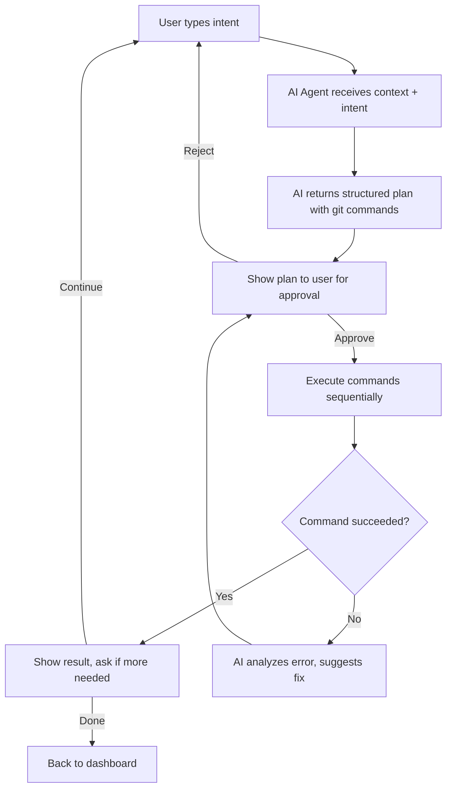

# 🤖 Zit Agent Mode — Implementation Plan

## Overview

Add an **Agent Mode** to zit — an interactive, AI-powered conversational CLI within the TUI where users describe their intent in plain English and the AI agent figures out which git commands to run, shows them for approval, executes them, and handles errors automatically.

Think of it as **Claude Code, but for git ops** — accessible via the `A` key from the dashboard.

---

## Architecture



### Key Design Decisions

1. **New View**: `View::Agent` — a full-screen conversational agent view
2. **New UI module**: `ui/agent.rs` — renders the chat-like agent interface
3. **New AI prompt**: `PROMPT_AGENT` in `ai/prompts.rs` — specialized system prompt that returns structured JSON with git commands
4. **New AI method**: `AiClient::agent_plan()` — sends user intent + full repo context, expects structured command plan back
5. **New AiAction**: `AiAction::AgentPlan` — for async result handling
6. **Conversation history**: The agent keeps a rolling conversation within the session so the AI has context of what was already done

---

## Files to Create/Modify

### 1. `src/ui/agent.rs` (NEW — ~450 lines)

The agent view — a chat-style interface with:
- **Conversation log**: Scrollable history of messages (user intents, AI plans, command outputs)
- **Input bar**: Bottom text input for typing natural language
- **Status indicators**: AI thinking, command executing, success/error
- **Plan approval UI**: When AI returns commands, show them with `[y] Execute  [n] Cancel  [e] Edit`

**State struct:**
```rust
pub struct AgentState {
    pub messages: Vec<AgentMessage>,     // conversation history
    pub input: String,                   // current user input
    pub input_mode: bool,                // whether input is active
    pub scroll: u16,                     // scroll position
    pub pending_plan: Option<AgentPlan>, // commands waiting for approval
    pub plan_selected: usize,            // selected command in plan view
    pub executing: bool,                 // command currently running
    pub execution_step: usize,           // which step in the plan we're on
}

pub struct AgentMessage {
    pub role: MessageRole,  // User, Agent, System, CommandOutput
    pub content: String,
    pub timestamp: String,
}

pub struct AgentPlan {
    pub explanation: String,         // What the AI thinks needs to happen
    pub steps: Vec<AgentStep>,       // Ordered list of commands
    pub warnings: Vec<String>,       // Safety warnings
    pub safety_level: SafetyLevel,   // SAFE, CAUTION, DESTRUCTIVE
}

pub struct AgentStep {
    pub command: Vec<String>,   // e.g. ["git", "add", "-A"]
    pub description: String,    // Human-readable explanation
    pub status: StepStatus,     // Pending, Running, Done, Failed, Skipped
    pub output: Option<String>, // Command output after execution
}
```

**Rendering:**
- Top: Title bar with `🤖 Agent Mode — describe what you want to do`
- Middle: Chat-like scrollable area with colored messages
  - User messages: right-aligned, cyan
  - Agent responses: left-aligned, green
  - Command outputs: monospace, dark gray
  - Errors: red
  - Plan blocks: bordered, with numbered steps
- Bottom: Input bar + keybindings

### 2. `src/ai/prompts.rs` (MODIFY)

Add `PROMPT_AGENT` — a system prompt that instructs the AI to:
- Analyze the user's intent + repo context
- Return a structured response with `[PLAN]` blocks containing exact git commands
- Include safety warnings for destructive operations
- Explain each step in plain English
- Format: `[PLAN_START]`, per-step `[STEP] command ||| description`, `[SAFETY] level`, `[PLAN_END]`

Add `PROMPT_AGENT_ERROR` — for when a command fails, the AI gets the error + context and suggests a fix.

### 3. `src/ai/client.rs` (MODIFY)

Add `pub fn agent_plan(&self, intent: &str, conversation_history: &[AgentMessage]) -> Result<String>` 
- Builds repo context
- Includes conversation history for multi-turn awareness
- Sends to AI with the agent system prompt

Add `pub fn agent_fix_error(&self, intent: &str, failed_command: &str, error: &str) -> Result<String>`
- When a command fails, asks the AI what went wrong and what to do next

### 4. `src/app.rs` (MODIFY)

- Add `View::Agent` to the `View` enum
- Add `agent_state: agent::AgentState` to `App`
- Add `AiAction::AgentPlan` and `AiAction::AgentFixError` to the AI action enum
- Add `start_ai_agent_plan()` method
- Add `execute_agent_step()` method — runs one git command from the plan
- Handle `AgentPlan` and `AgentFixError` results in `poll_ai_result()`
- Add `A` (uppercase) key from Dashboard to enter Agent mode
- Navigation key mapping in Dashboard

### 5. `src/main.rs` (MODIFY)

- Add `View::Agent => ui::agent::render(...)` in the draw function
- Add agent view to help text
- Handle agent view in the event loop

### 6. `src/ui/mod.rs` (MODIFY)

- Add `pub mod agent;`

---

## User Flow

```
1. User presses 'A' from Dashboard → enters Agent Mode
2. Sees: "🤖 What would you like to do? Describe your goal in plain English."
3. User types: "I accidentally committed a secret API key in the last commit, remove it from history"
4. AI analyzes repo context + intent, returns:
   ┌─────────────────────────────────────────────────────────┐
   │ 🤖 Agent Plan                                   🔴 RISKY │
   │                                                         │
   │ I'll help you remove the secret from git history.       │
   │ Here's what I'll do:                                    │
   │                                                         │
   │  1. git log --oneline -5                                │
   │     → Check recent commits to identify the one with     │
   │       the secret                                        │
   │                                                         │
   │  2. git rebase -i HEAD~2                                │
   │     → Interactive rebase to edit the commit             │
   │     ⚠️ This rewrites history!                            │
   │                                                         │
   │  3. git push --force-with-lease                         │
   │     → Push the rewritten history safely                 │
   │                                                         │
   │ ⚠️ WARNING: This will rewrite git history.               │
   │ If others have pulled, they'll need to re-pull.         │
   │                                                         │
   │  [y] Execute All  [s] Step-by-step  [n] Cancel          │
   └─────────────────────────────────────────────────────────┘
5. User presses 's' for step-by-step execution
6. Each command runs, output shown inline
7. If a command fails → AI automatically diagnoses and suggests fix
8. When done → "✓ All steps complete. Anything else?"
```

---

## Implementation Order

1. **Phase 1**: Create `ui/agent.rs` with state structs, render function, and key handlers
2. **Phase 2**: Add agent prompt to `ai/prompts.rs` — the structured plan prompt
3. **Phase 3**: Add `agent_plan()` and `agent_fix_error()` to `ai/client.rs`
4. **Phase 4**: Wire everything into `app.rs` — View, state, AI dispatch, execution logic
5. **Phase 5**: Update `main.rs` and `ui/mod.rs` for routing
6. **Phase 6**: Polish — error recovery, conversation context, safety confirmations

---

## Safety Considerations

- **NEVER auto-execute destructive commands** (`--force`, `reset --hard`, `clean -fd`, etc.)
- Commands tagged `DESTRUCTIVE` require explicit `y` confirmation per-step
- Show clear warnings before force pushes or history rewrites  
- All executed commands are logged to the conversation for auditability
- Agent respects the existing secret scanning pipeline
